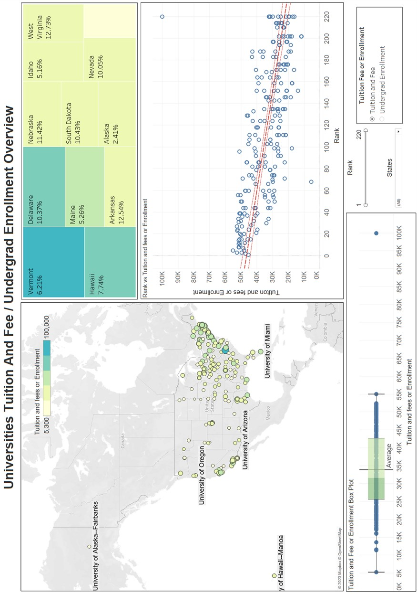

# My Data Analytics Portfolio

Please see my Completed Data Analytics Projects below.

## 2024

- **[Shopper Profile](https://seikyo.shinyapps.io/ShopperProfile/)**  
  *Description*: This is a Shiny dashboard to showcase Shopper Profile in Singapore.  
  *Software* : R, SQL, Python  
  *Script* : [Link](https://github.com/SeikyoX/MyPortfolio/tree/main/ShopperProfile)  
    

- **[The Legacy of Civil War:Landmines, ERWs, and Their Effects on Cambodian Communities](https://rpubs.com/seikyox/1242723)**  
  *Description*: This is a R Markdown Generated Report On Cambodia Mine Analysis.  
  *Software* : R  
  *Script* : [Link](https://github.com/SeikyoX/MyPortfolio/tree/main/CambodiaMine)
  
## 2023 

- **[US Universities Ranking, Tuition Fee and Enrollment](https://github.com/SeikyoX/MyPortfolio/tree/main/USUniversities/USUniversitiesRankingTuitionFeeandEnrollment.pdf)**  
  *Description*: : Use Data Visualization Tool to find relationship between US Universities ranking, tuition fee and enrollment.  
  *Software* : Tableau  
  *Script* : [Link](https://github.com/SeikyoX/MyPortfolio/tree/main/USUniversities)  
    
    

- **[Stock Prices Dataset Analysis](https://github.com/SeikyoX/MyPortfolio/tree/main/StockPrice/StockPrice.pdf)**  
  *Description*: Analysis of stock prices dataset with various analytics method (MAPE, MSD, MAD and ARIMA) and provide the future forecast.  
  *Software* : SAS, Microsoft Excel  
  *Script* : [Link](https://github.com/SeikyoX/MyPortfolio/tree/main/StockPrice)

## 2022 

- **[Application Of Text Mining On Hotel Market Intelligence](https://github.com/SeikyoX/MyPortfolio/tree/main/HotelMarketIntel/HotelMarketIntel.pdf)**  
  *Description*: Apply Text Mining on company review to obtain insights and propose potential actions.  
  *Software* : SPSS  
  *Script* : [Link](https://github.com/SeikyoX/MyPortfolio/tree/main/HotelMarketIntel)

- **[ShineBank Credit Card Churn Analysis](https://github.com/SeikyoX/MyPortfolio/tree/main/ShineBank/ShineBank.pdf)**  
  *Description*: Using Predictive Modelling on a bank dataset to understand the incidence of credit card churn cluster profile and make recommendations.  
  *Software* : SPSS  
  *Script* : [Link](https://github.com/SeikyoX/MyPortfolio/tree/main/ShineBank)

## 2021 

- **[House Price Analysis](https://github.com/SeikyoX/MyPortfolio/tree/main/HousePrice/HousePrice.pdf)**  
  *Description*: Using Regression Modelling on home selling price dataset to understand the relationship between selling price, living area, number of beds, bathrooms.  
  *Software* : JMP  
  *Script* : [Link](https://github.com/SeikyoX/MyPortfolio/tree/main/HousePrice)

- **[Online Shoppers Purchasing Intention](https://github.com/SeikyoX/MyPortfolio/tree/main/OnlineShoppers/OnlineShoppers.pdf)**  
  *Description*: : Using Predictive Modelling on Online Customer Dataset to generate an appropriate decision tree models for deployment.  
  *Software* : SPSS  
  *Script* : [Link](https://github.com/SeikyoX/MyPortfolio/tree/main/OnlineShoppers)

## 2020

- **[Pittsburgh Bike Share Analysis](https://github.com/SeikyoX/MyPortfolio/tree/main/PittsburghBikeShareAnalysis/PittsburghBikeShareAnalysis.pdf)**  
  *Description*: Using different clustering methods to obtain Insight from a bike sharing dataset and finding ways to increase ridership.  
  *Software* : SPSS  
  *Script* : [Link](https://github.com/SeikyoX/MyPortfolio/tree/main/PittsburghBikeShareAnalysis)

- **[Chronic Kidney Disease (CKD) Symptoms Prediction](https://github.com/SeikyoX/MyPortfolio/tree/main/ChronicKidneyDisease/ChronicKidneyDisease.pdf)**  
  *Description*: Using Clustering method to segment the patients' demographics and various health screening tests to help identify groups of patients that might highly have risk of being diagnosed with CKD.  
  *Software* : SPSS  
  *Script* : [Link](https://github.com/SeikyoX/MyPortfolio/tree/main/ChronicKidneyDisease)
